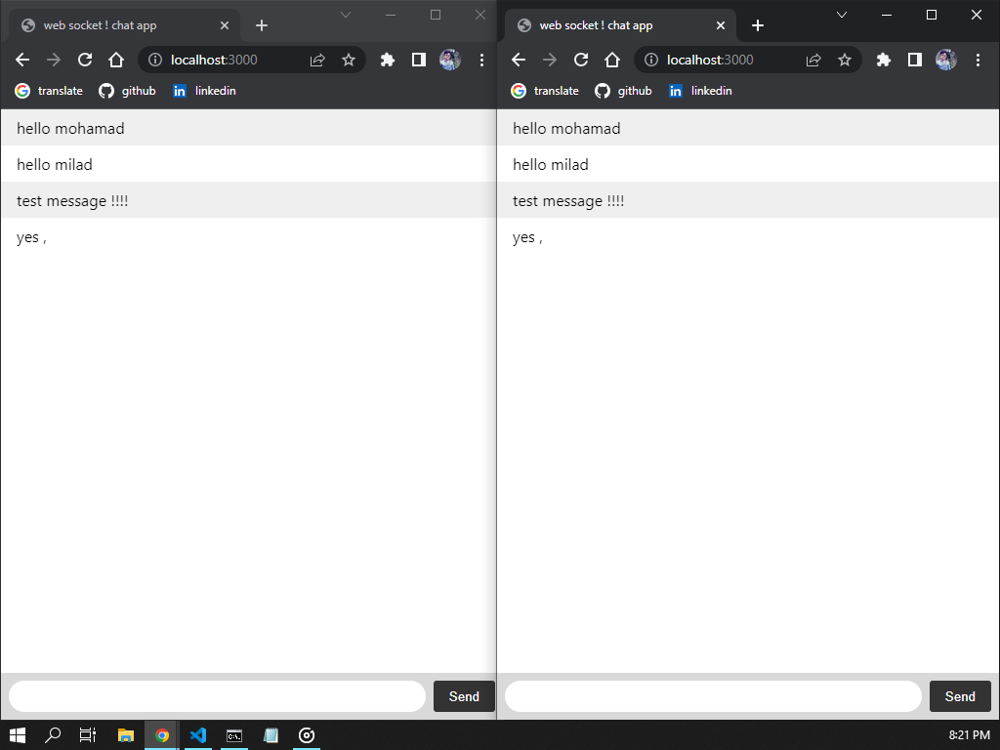

# Mini chat app , using node.js and socket.io


## About 

hello 
I made this repository while learning <a target="_blank" href="https://socket.io/">Socket.io</a>
A simple chat app where two users can communicate




## Run app

```
npm install 

npm run dev

```

